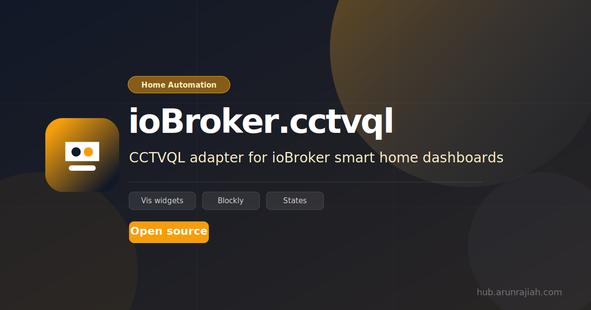

<p align="center">
  
</p>

<p align="center">
  
</p>

# ioBroker.cctvql

ioBroker adapter for [cctvQL](https://github.com/arunrajiah/cctvql) — a natural-language query layer for CCTV systems.

Ask questions like *"Were there any people at the front door last night?"* directly from ioBroker scripts and Blockly flows, fetch live detection events, and send PTZ commands — across Frigate, Hikvision, Synology, Dahua, Milestone, ONVIF, and more.

---

## Prerequisites

A running [cctvQL server](https://github.com/arunrajiah/cctvql):

```bash
docker run -p 8000:8000 \
  -e CCTVQL_ADAPTER=frigate \
  -e CCTVQL_FRIGATE_HOST=http://192.168.1.100:5000 \
  ghcr.io/arunrajiah/cctvql:latest
```

---

## Configuration

| Field | Default | Description |
|---|---|---|
| Host | `localhost` | cctvQL server hostname or IP |
| Port | `8000` | cctvQL server port |
| Protocol | `http` | `http` or `https` |
| API Key | *(empty)* | Optional; leave blank if auth is off |
| Polling Interval | `30` s | How often to fetch detection events |

---

## Data Points

### Query

| ID | Type | Description |
|---|---|---|
| `cctvql.0.query.send` | string (writable) | Write a natural-language question here to trigger a query |
| `cctvql.0.query.answer` | string | Plain-text answer from cctvQL |
| `cctvql.0.query.intent` | string | Detected intent (e.g. `query_events`) |

### Events

| ID | Type | Description |
|---|---|---|
| `cctvql.0.events.latest` | JSON string | Array of recent detection events |
| `cctvql.0.events.count` | number | Count of recent events |
| `cctvql.0.cameras.<id>.lastEvent` | JSON string | Last event per camera (auto-created) |

### Status

| ID | Type | Description |
|---|---|---|
| `cctvql.0.info.connection` | boolean | `true` when cctvQL is reachable |

---

## Example: Query in a Script

```javascript
// In an ioBroker JavaScript adapter script:
setState('cctvql.0.query.send', 'Any cars in the driveway today?');

on({ id: 'cctvql.0.query.answer', change: 'any' }, (obj) => {
    log('cctvQL says: ' + obj.state.val);
    // → "Yes, a white SUV was detected at 14:32 and 17:10."
});
```

---

## Changelog

### 1.0.2 (2026-06-07)
* Update @alcalzone/release-script* to 5.2.x (checker E0036)
* Require Node.js >= 24; update CI deploy job to node 24 (checker E3022)
* Add i18n key for `placeholder` in jsonConfig host field (checker E5612)

### 1.0.1 (2026-04-27)
* Add bluefox as npm collaborator

### 1.0.0 (2026-04-21)
* Initial release — natural-language queries, event polling, PTZ control

---

[Older changelogs can be found there](CHANGELOG_OLD.md)

## License

MIT License

Copyright (c) 2026 arunrajiah <arunrajiah@gmail.com>

Permission is hereby granted, free of charge, to any person obtaining a copy of this software and associated documentation files (the "Software"), to deal in the Software without restriction, including without limitation the rights to use, copy, modify, merge, publish, distribute, sublicense, and/or sell copies of the Software, and to permit persons to whom the Software is furnished to do so, subject to the following conditions:

The above copyright notice and this permission notice shall be included in all copies or substantial portions of the Software.

THE SOFTWARE IS PROVIDED "AS IS", WITHOUT WARRANTY OF ANY KIND, EXPRESS OR IMPLIED, INCLUDING BUT NOT LIMITED TO THE WARRANTIES OF MERCHANTABILITY, FITNESS FOR A PARTICULAR PURPOSE AND NONINFRINGEMENT. IN NO EVENT SHALL THE AUTHORS OR COPYRIGHT HOLDERS BE LIABLE FOR ANY CLAIM, DAMAGES OR OTHER LIABILITY, WHETHER IN AN ACTION OF CONTRACT, TORT OR OTHERWISE, ARISING FROM, OUT OF OR IN CONNECTION WITH THE SOFTWARE OR THE USE OR OTHER DEALINGS IN THE SOFTWARE.
